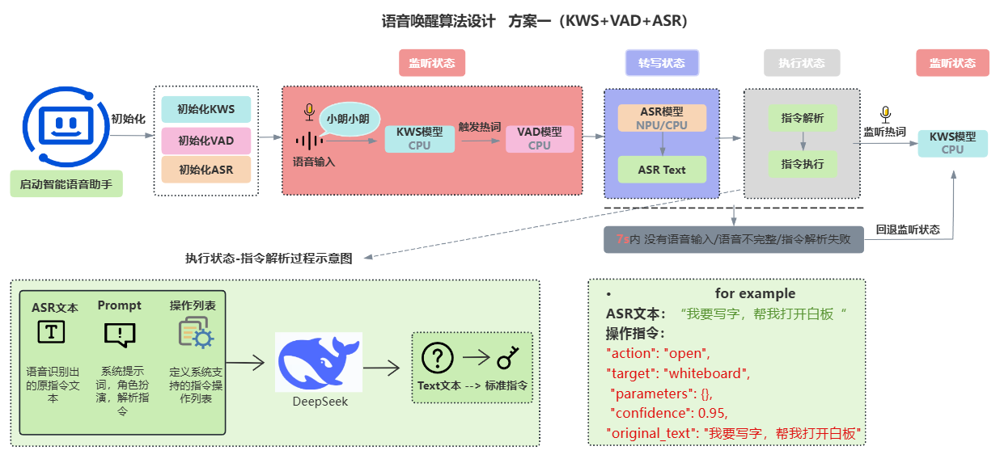

# AI 语音助手 - 智慧教室自动化控制系统

## 项目简介

这是一个面向课堂自动化的 AI 语音助手 Android 应用，专为 RK3576 和 MTKG520 硬件平台设计。应用实现了完整的语音交互流程：**唤醒词检测 → 语音命令识别 → 意图解析 → 设备控制**。

## 算法架构



应用采用 **KWS（关键词识别） + VAD（语音活动检测） + ASR（语音识别）** 三层架构：

1. **监听状态**：KWS 模型持续监听唤醒词
2. **激活状态**：检测到唤醒词后，VAD 模型开始检测语音输入
3. **处理状态**：ASR 模型识别语音内容，通过 DeepSeek LLM 解析意图并执行命令
4. **循环反馈**：命令执行完成后返回监听状态

> **注意**: 本项目使用**离线 ASR 模型**（Offline Recognizer），不依赖在线流式识别，确保隐私安全和低延迟响应。

### 核心功能

- **智能唤醒**: 支持多个唤醒词（"你好军哥"、"小艺小艺"、"小米小米" 等）
- **语音识别**: 基于 Sherpa-ONNX 的高精度中文语音识别
- **意图理解**: 使用 DeepSeek LLM 进行自然语言意图解析
- **设备控制**: 支持白板、投影仪、窗帘、灯光、空调、音响等教室设备控制
- **硬件加速**: 支持 RK3576/RK3588 RKNN NPU 加速

### 技术栈

- **UI 框架**: Jetpack Compose
- **开发语言**: Kotlin + C++ (JNI)
- **语音引擎**: Sherpa-ONNX (ONNX/RKNN 推理)
- **AI 服务**: DeepSeek Chat API
- **音频处理**: 16kHz 单声道 PCM

## 快速开始

### 环境要求

- Android Studio Ladybug (2024.2.1) 或更高版本
- Android SDK 24 (最低) / SDK 35 (目标)
- JDK 11+
- 已连接的 Android 设备或模拟器

### ⚠️ 重要：模型文件配置

由于模型文件体积较大（100+ MB），本仓库**不包含**模型文件。首次使用前，请按以下步骤配置：

#### 1. 下载模型文件

需要下载以下模型并放置到对应目录：

**关键词识别模型 (KWS)**：
- 下载地址：[sherpa-onnx-kws-zipformer-wenetspeech-3.3M-2024-01-01](https://github.com/k2-fsa/sherpa-onnx/releases)
- 放置位置：`SherpaOnnxSimulateStreamingAsr/app/src/main/assets/sherpa-onnx-kws-zipformer-wenetspeech-3.3M-2024-01-01/`
- 必需文件：`encoder-*.onnx`、`decoder-*.onnx`、`joiner-*.onnx`、`tokens.txt`、`keywords.txt`

**ASR 模型（离线识别）**：
- 下载地址：[sherpa-onnx-zipformer-ctc-small-zh-fp16-2025-07-16](https://github.com/k2-fsa/sherpa-onnx/releases)
- 放置位置：`SherpaOnnxSimulateStreamingAsr/app/src/main/assets/sherpa-onnx-zipformer-ctc-small-zh-fp16-2025-07-16/`
- 必需文件：`model.fp16.onnx`、`tokens.txt`

**VAD 模型**：
- 下载地址：[silero_vad.onnx](https://github.com/k2-fsa/sherpa-onnx/releases)
- 放置位置：`SherpaOnnxSimulateStreamingAsr/app/src/main/assets/silero_vad.onnx`

**音频反馈文件**（可选）：
- 放置位置：`SherpaOnnxSimulateStreamingAsr/app/src/main/assets/sounds/`
- 文件：`listening.mp3`、`processing.mp3`、`completed.mp3`

#### 2. 验证目录结构

确保你的 `assets` 目录结构如下：

```
app/src/main/assets/
├── sherpa-onnx-kws-zipformer-wenetspeech-3.3M-2024-01-01/
│   ├── encoder-epoch-12-avg-2-chunk-16-left-64.onnx
│   ├── decoder-epoch-12-avg-2-chunk-16-left-64.onnx
│   ├── joiner-epoch-12-avg-2-chunk-16-left-64.onnx
│   ├── tokens.txt
│   └── keywords.txt
├── sherpa-onnx-zipformer-ctc-small-zh-fp16-2025-07-16/
│   ├── model.fp16.onnx
│   └── tokens.txt
├── silero_vad.onnx
└── sounds/
    ├── listening.mp3
    ├── processing.mp3
    └── completed.mp3
```

#### 3. RKNN 硬件加速模型（可选）

如需使用 RK3576/RK3588 硬件加速，可额外下载 RKNN 模型：
- SenseVoice RKNN 模型
- 放置位置：`SherpaOnnxSimulateStreamingAsr/app/src/main/assets/sense-voice-rknn/`

> **提示**：所有大型资源文件已在 `.gitignore` 中配置忽略，不会被提交到仓库。

### 构建与安装

```bash
# 进入项目目录
cd SherpaOnnxSimulateStreamingAsr

# 构建 Debug APK
./gradlew assembleDebug

# 构建并安装到设备
./gradlew installDebug

# 清理构建
./gradlew clean
```

### 手动安装

```bash
# 通过 adb 安装
adb install -r app/build/outputs/apk/debug/app-debug.apk
```

### 查看日志

```bash
# 查看语音助手相关日志
adb logcat | grep -E "VoiceAssistant|KeywordSpotter|OfflineRecognizer"
```

## 系统架构

### 语音助手状态机

应用遵循三状态流程（由 `VoiceAssistant.kt` 控制）：

1. **LISTENING（监听中）**: 通过 KeywordSpotter 监听唤醒词
2. **ACTIVATED（已激活）**: 检测到唤醒词，播放提示音，准备接收命令
3. **PROCESSING（处理中）**: VAD + ASR 激活，识别语音命令并执行

```
[监听唤醒词] --检测到唤醒词--> [已激活] --开始说话--> [处理命令] --执行完成--> [监听唤醒词]
```

### 核心组件

#### 语音识别层 (`com.k2fsa.sherpa.onnx`)

- **KeywordSpotter.kt** - 唤醒词检测
- **OfflineRecognizer.kt** - 离线批量 ASR (支持 44+ 种模型类型，本项目使用此模型)
- **Vad.kt** - 语音活动检测 (Silero VAD 模型)

> **注意**: 本项目**仅使用离线 ASR 模型**（OfflineRecognizer），不使用在线流式识别（OnlineRecognizer），确保数据隐私和稳定性。

#### 语音助手层 (`com.k2fsa.sherpa.onnx.simulate.streaming.asr`)

- **VoiceAssistant.kt** - 状态机控制器
- **VoiceAssistantManager.kt** - 单例生命周期管理器
- **MainActivity.kt** - 应用入口点，初始化所有模型
- **screens/Home.kt** - UI 和主音频处理循环

#### 意图与命令执行层

- **IntentManager.kt** - 基于 LLM 的自然语言意图解析器
- **DeepSeekClient.kt** - DeepSeek Chat API 客户端
- **CommandExecutor.kt** - 执行解析后的设备控制意图
- **设备控制器**: WhiteboardController、ProjectorController、CurtainController、LightController、AirConditionerController、SpeakerController

### 初始化流程

在 `MainActivity.onCreate()` 中按顺序初始化：

1. 请求 `RECORD_AUDIO` 权限
2. 加载 ASR 模型（Zipformer-CTC 中文小模型）
3. 加载 VAD 模型（Silero VAD）
4. 初始化唤醒词检测器（Zipformer-WenetSpeech）
5. 初始化 DeepSeek API 客户端

## 语音识别模型

### 当前模型配置

#### 关键词识别 (KWS) - 类型 0
- **模型**: `sherpa-onnx-kws-zipformer-wenetspeech-3.3M-2024-01-01`
- **位置**: `app/src/main/assets/sherpa-onnx-kws-zipformer-wenetspeech-3.3M-2024-01-01/`
- **唤醒词**: 在 `keywords.txt` 中定义（支持 9 个唤醒词）
- **文件**: encoder/decoder/joiner ONNX 模型 + tokens.txt

#### ASR (自动语音识别 - 离线模型) - 类型 39
- **模型**: `sherpa-onnx-zipformer-ctc-small-zh-fp16-2025-07-16`
- **类型**: ZipformerCtc（中文离线识别）
- **文件**: `model.fp16.onnx`
- **提供者**: CPU（可切换到 "rknn" 启用硬件加速）
- **特点**: 完全离线运行，无需网络连接，保护用户隐私

#### VAD (语音活动检测) - 类型 0
- **模型**: Silero VAD
- **文件**: `silero_vad.onnx`
- **配置**:
  - 窗口大小: 512 采样
  - 最小静音: 0.8 秒
  - 最小语音: 0.25 秒
  - 采样率: 16kHz

### 添加/更改模型

模型通过工厂函数配置，位于各自的类中：

- **KWS**: `KeywordSpotter.kt` → `getKwsModelConfig(type: Int)`
- **ASR**: `OfflineRecognizer.kt` → `getOfflineModelConfig(type: Int)` (第 686-790 行)
- **VAD**: `Vad.kt` → `getVadModelConfig(type: Int)`

#### 添加新模型步骤:

1. 将模型文件放入 `app/src/main/assets/`
2. 在相应的 `getXxxModelConfig()` 函数中添加新类型编号
3. 指定模型路径、tokens 文件和提供者（cpu/rknn）
4. 如需新文件扩展名，更新 `build.gradle.kts` 中的 `aaptOptions`

### 硬件加速 (RKNN)

支持 RK3576/RK3588 硬件的 RKNN 加速模型（类型 100-102）：

- **类型 100**: SenseVoice（基于 Paraformer，多语言）
- **类型 101**: Whisper medium
- **类型 102**: Paraformer 三语言

在模型配置中设置 `provider = "rknn"` 以启用 NPU 加速。

## 意图识别系统

### DeepSeek LLM 集成

- **端点**: `https://api.deepseek.com/chat/completions`
- **模型**: `deepseek-chat`
- **输入**: 来自 ASR 的用户语音命令文本
- **输出**: 结构化 JSON，包含 `action`、`target`、`parameters`、`confidence`

### 支持的操作

- **open** (打开): 打开设备或功能
- **close** (关闭): 关闭设备或功能
- **adjust** (调节): 调节设备参数（亮度、温度、音量等）
- **query** (查询): 查询设备状态

### 支持的设备

| 设备 | 标识符 | 控制器 |
|------|--------|--------|
| 白板 | whiteboard | WhiteboardController |
| 投影仪 | projector | ProjectorController |
| 窗帘 | curtain | CurtainController |
| 灯光 | light | LightController |
| 空调 | air_conditioner | AirConditionerController |
| 音响 | speaker | SpeakerController |

> **注意**: 当前设备控制器为模拟实现，需要集成实际的设备 SDK。

## 音频反馈

应用使用音效提供用户反馈，音频文件位于 `app/src/main/assets/sounds/`：

- **listening.mp3** - "你说我在听"（检测到唤醒词后播放）
- **processing.mp3** - "我来帮你操作"（执行命令前播放）
- **completed.mp3** - "操作已完成"（成功执行后播放）

音频由 `AudioPlayer.kt` 单例使用 MediaPlayer 管理。

## 项目结构

```
AI-aduio-asistant/
├── SherpaOnnxSimulateStreamingAsr/        # 主项目目录
│   ├── app/
│   │   ├── src/main/
│   │   │   ├── assets/                     # 模型和资源文件
│   │   │   │   ├── sherpa-onnx-kws-*      # 唤醒词模型
│   │   │   │   ├── sherpa-onnx-zipformer-* # ASR 模型
│   │   │   │   ├── silero_vad.onnx        # VAD 模型
│   │   │   │   └── sounds/                # 音效文件
│   │   │   ├── java/com/k2fsa/sherpa/onnx/
│   │   │   │   ├── KeywordSpotter.kt      # 唤醒词检测
│   │   │   │   ├── OfflineRecognizer.kt   # ASR 引擎
│   │   │   │   ├── Vad.kt                 # VAD 引擎
│   │   │   │   ├── VoiceAssistant.kt      # 状态机
│   │   │   │   ├── IntentManager.kt       # 意图解析
│   │   │   │   ├── DeepSeekClient.kt      # LLM 客户端
│   │   │   │   ├── CommandExecutor.kt     # 命令执行
│   │   │   │   └── simulate/streaming/asr/
│   │   │   │       ├── MainActivity.kt    # 应用入口
│   │   │   │       └── screens/Home.kt    # 主界面
│   │   │   └── jniLibs/arm64-v8a/         # 原生库
│   │   │       ├── libsherpa-onnx-jni.so
│   │   │       └── libonnxruntime.so
│   │   └── build.gradle.kts               # 应用构建配置
│   ├── build.gradle.kts                   # 项目构建配置
│   └── settings.gradle.kts                # 仓库设置
├── CLAUDE.md                              # Claude Code 项目指南
└── README.md                              # 本文件
```

## 关键技术细节

### 内存管理

所有 ONNX 模型必须在生命周期回调中显式释放：

- `MainActivity.onDestroy()` 释放 OfflineRecognizer 和 VAD
- `VoiceAssistant.release()` 释放 KeywordSpotter
- 未释放会导致内存泄漏（模型在内存中占用 100+ MB）

### 线程安全

- `SimulateStreamingAsr` 单例使用同步初始化
- 音频处理使用独立协程：
  - 音频采集运行在 `Dispatchers.IO`
  - 音频处理运行在 `Dispatchers.Default`
- StateFlow 提供线程安全的状态更新

### 音频处理参数

- **采样率**: 16kHz
- **声道**: 单声道
- **位深度**: PCM 16位
- **缓冲区大小**: 0.1秒块（1600 采样）
- **VAD 窗口**: 512 采样
- **ASR 累积**: 直到 VAD 检测到语音段结束

### 错误处理

- VAD/ASR 操作包裹在 try-catch 中，带状态重置回退
- DeepSeekClient 中的网络错误记录日志但不会崩溃应用
- assets 中缺少模型会导致初始化失败（检查日志）

## 调试指南

### 调试语音识别问题

1. **检查日志**: 查看 logcat 中的 KeywordSpotter/OfflineRecognizer 消息
2. **验证唤醒词**: 检查 `assets/sherpa-onnx-kws-zipformer-wenetspeech-3.3M-2024-01-01/keywords.txt`
3. **调整 VAD 灵敏度**: 修改 `Vad.kt` 中的 `minSilenceDuration` 和 `minSpeechDuration`
4. **切换 ASR 模型**: 更改 `MainActivity.initOfflineRecognizer()` 中的模型类型
5. **查看中间结果**: Home.kt 已实现每 500ms 显示一次中间识别结果

### 常见问题

**Q: 应用无法识别唤醒词？**
- 检查麦克风权限是否已授予
- 验证唤醒词是否在 keywords.txt 中
- 查看 logcat 日志确认模型是否正确加载

**Q: 识别结果不准确？**
- 尝试更换不同的 ASR 模型（类型 39、100-102）
- 调整 VAD 参数以更好地检测语音边界
- 确保环境噪音不太大

**Q: 应用崩溃或内存泄漏？**
- 确保在 onDestroy() 中正确释放所有模型
- 检查是否正确处理了协程和音频资源

## 开发计划

- [ ] 集成实际设备控制 SDK
- [ ] 添加更多唤醒词和命令
- [ ] 优化 RKNN 硬件加速性能
- [ ] 支持多轮对话
- [ ] 添加离线意图识别（减少对云端 API 的依赖）
- [ ] 实现用户自定义命令配置

## 许可证

本项目使用的主要开源组件：

- **Sherpa-ONNX**: Apache License 2.0
- **DeepSeek API**: 需要 API 密钥

## 贡献

欢迎提交 Issue 和 Pull Request！

## 联系方式

如有问题或建议，请通过 GitHub Issues 联系。
